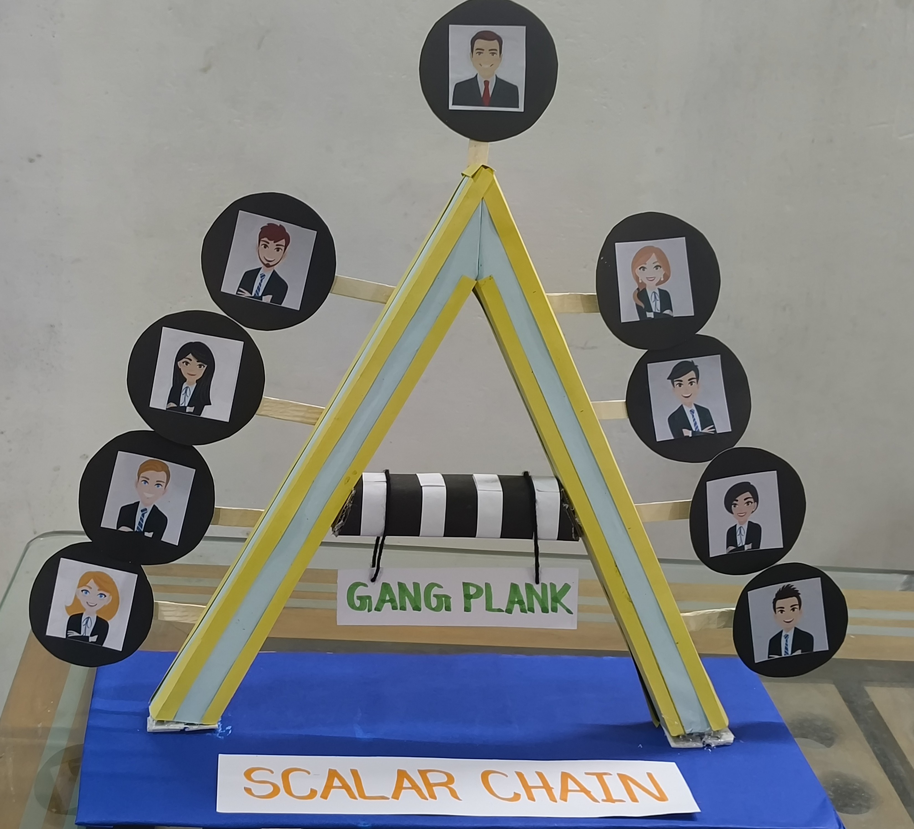
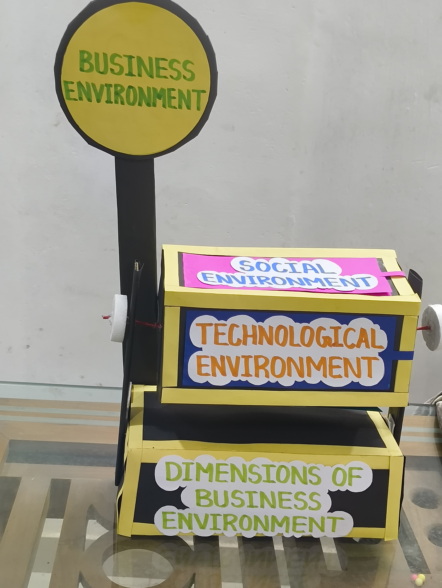
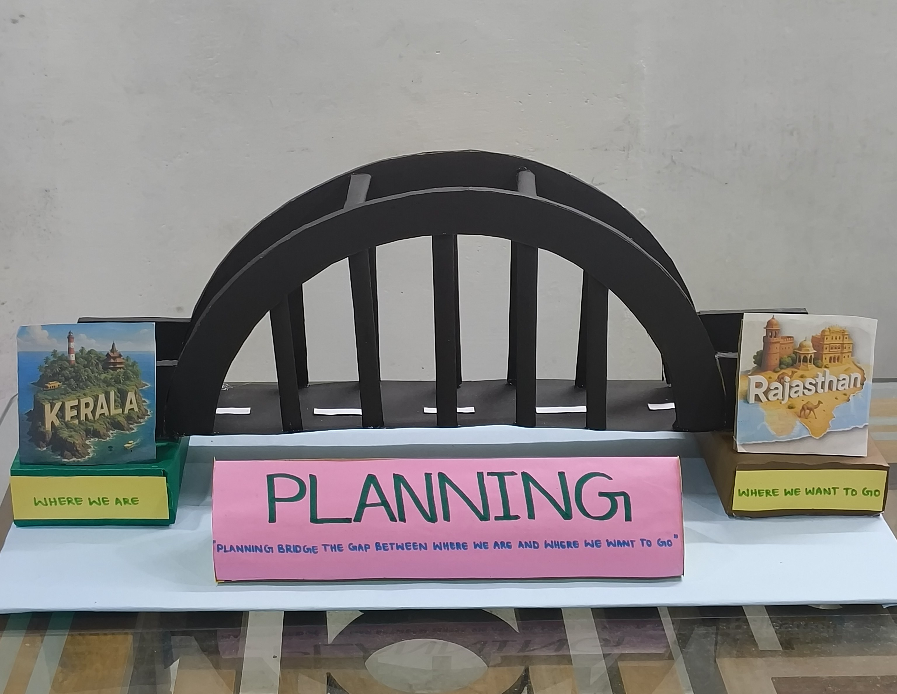
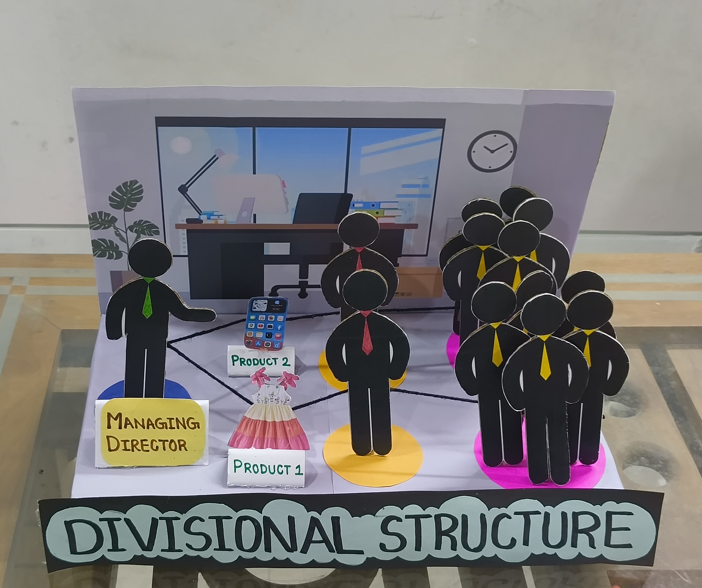
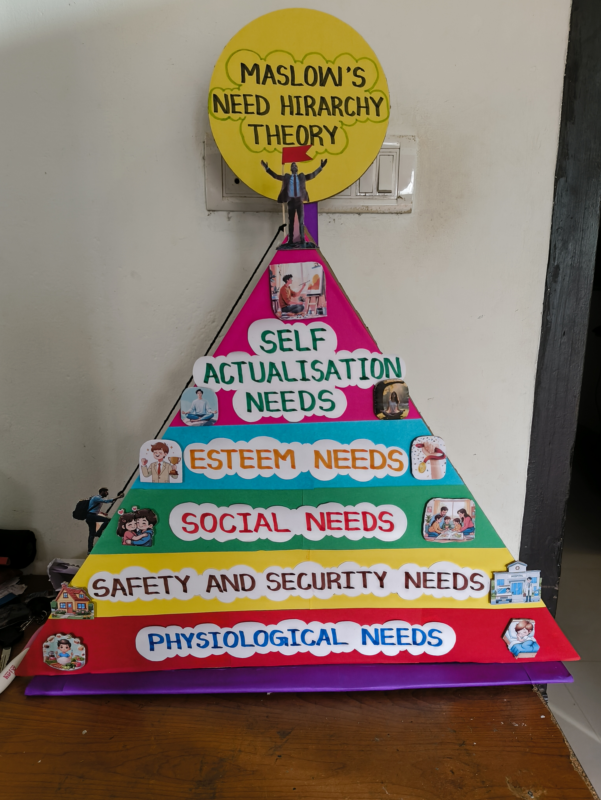
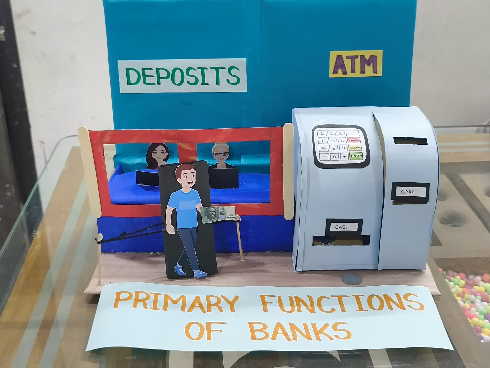
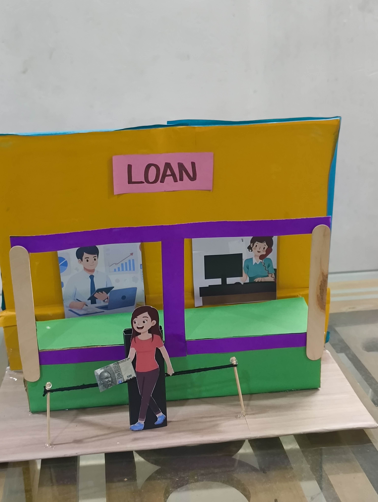
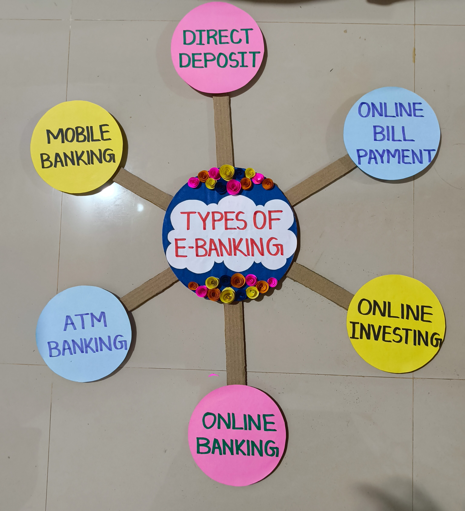
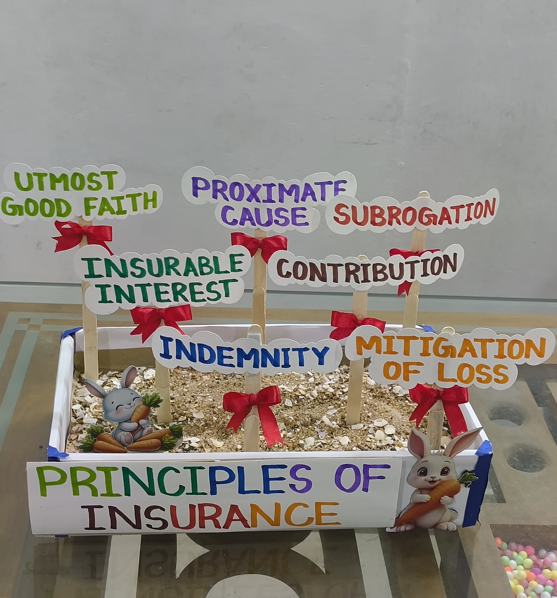
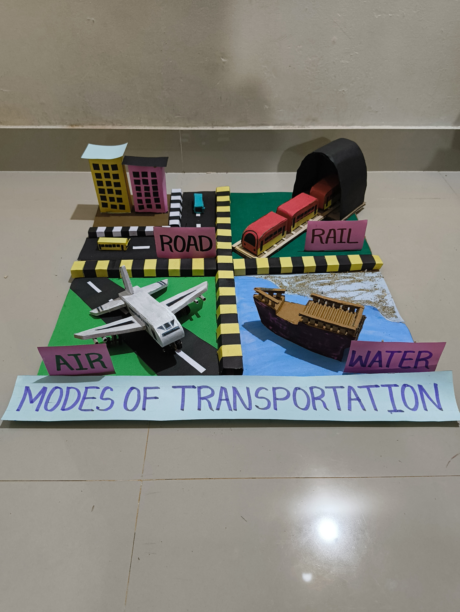

<!DOCTYPE html>
<html lang="en">
<head>
    <meta charset="UTF-8">
    <title>CRAFT WORLD</title>
    
</head>
<body>

<header>
    <h1>HEAVEN OF CRAFTS</h1>
    
•Beautiful  •Creative  •Curious  •Aesthetic

</header>

<nav>
    <a href="#">Home</a>
    <a href="#">About</a>
    <a href="#">Crafts</a>
    <a href="#">Contact</a>
</nav>

<!-- HOME -->
<section id="home">
    <h2>Welcome</h2>
    

                   Craft World is a creative platform that presents handmade learning models
        and artistic crafts. 
                  These creations combine creativity with education,
        helping learners to understand concepts visually and practically.
    

</section>

<!-- ABOUT -->
<section id="about">
    <h2>About Us</h2>
    

        Heaven of Crafts promotes creativity through handmade educational models
        and decorative crafts that support learning through art and imagination.
    

</section>

    HANDMADE WITH LOVE

    <!-- CRAFT IMAGES SECTION -->
    <h2>LEARNING MODELS</h2>

    

   

    
    <h3>SCALAR CHAIN</h3>
    
Connecting the Peak to the Foundation.

        

            
            <h3>BUSINESS ENVIRONMENT</h3>
            
Navigating the External Forces Shaping Business.

        

        
        

        <video controls style="width:75%; max-width:700px;">
            <source src="video1.mp4" type="video/mp4">
       </video>

        

            
            <h3>PLANNING</h3>
            
Bridging the Gap: From Where We Are to Where We Want to Be.

        

        

            
            <h3>DIVISIONAL STRUCTURE</h3>
            
Organizing for Efficiency through Specialized Business Units.

        

 
         

            
            <h3>ELEMENTS OF DELEGATION</h3>
            
y Empowering Teams through Authority, Responsibility, and Accountability.

        

         

            
            <h3>NEED HIERARCHY THEORY</h3>
            
Understanding What Drives Us: From Survival to Self-Actualization.

        

        
        

            
            <h3>ACCEPTING DEPOSITS</h3>
            
Mobilizing Savings: The Foundation of Commercial Banking.

        

        
        

            
            <h3>LENDING OF MONEY</h3>
            
Advancing Credit to Fuel Economic Growth.

        

        
        <video controls style="width:75%; max-width:700px;">
            <source src="video2.mp4" type="video/mp4">
       </video>
         
         

            
            <h3>E BANKING</h3>
            
Digital Solutions for Seamless 24/7 Banking.

        

        
        

            
            <h3>PRINCIPLES OF INSURANCE</h3>
            
The Fundamental Pillars of Risk Protection..

        

        
        

            
            <h3>MODES OF TRANSPORTATION</h3>
            
Connecting Markets through Land, Air, and Water.

        

    

<!-- CONTACT -->
<section id="contact">
    <h2>Contact Us</h2>
    

              Phone: 7034089300
     

     

             Email: heavenofcrafts@email.com
      

      

              Kerala, India
      

</section>

<footer>
    
© 2026 HEAVEN OF CRAFTS| All Rights Reserved

</footer>

</body>
</html>
